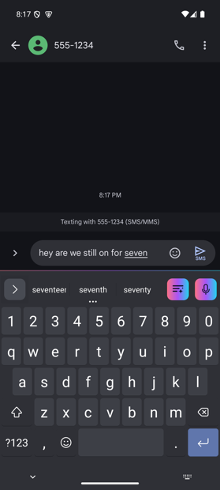
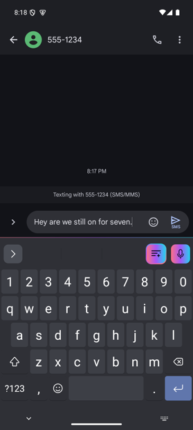
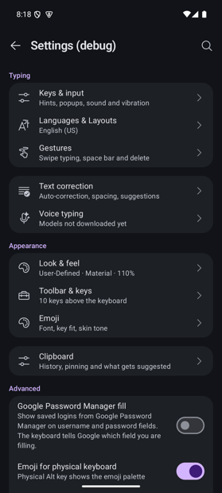
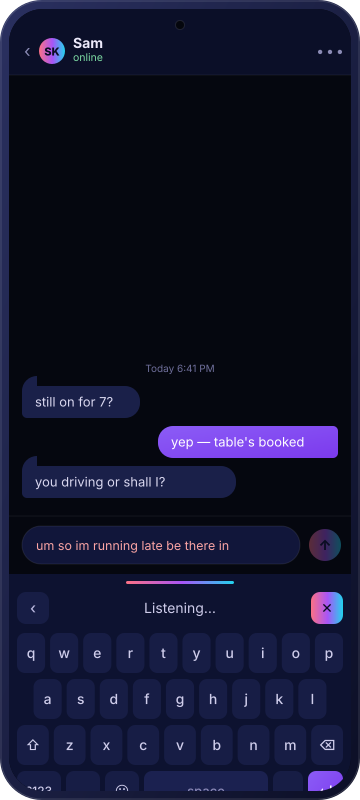
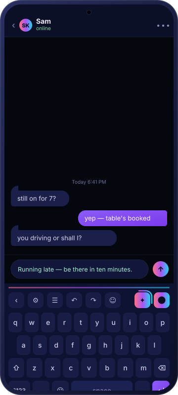

<div align="center">

# WaveKey

### Your voice never leaves the phone.

An Android keyboard that transcribes speech, cleans it up and rewrites it —
with two AI models running **entirely on the device**. **Free, with no subscription
and no minute counter.** No account, no API key, no server, and no network
permission in the keyboard process at all.

### [**See it in motion → nvkudva.github.io/WaveKey**](https://nvkudva.github.io/WaveKey/)

[](https://nvkudva.github.io/WaveKey/)
[](#free-and-free-of-a-meter)
[](LICENSE)
[](#requirements)
[](#the-two-models)
[](#the-two-models)
[](#privacy-is-the-architecture)

</div>

---

## What it does

| | |
|---|---|
| 💸 **Free, and free of a meter** | No subscription, no trial, no minutes to run out of, no tier that unlocks the better model. There is no server to bill you for. |
| 🎙️ **Dictate and edit at the same time** | The mic stays live while text lands. A pause ends the *sentence*, not the session — so you can speak, watch it commit, fix a word with your thumb, and keep speaking. |
| 🧠 **Two models, both on-device** | **Parakeet TDT 0.6B** turns speech into words. **Qwen 3 0.6B** turns those words into writing. Neither one leaves the phone. |
| ✨ **AI fix, always within reach** | One key runs the deterministic rules and then the LLM over what you just wrote — spelling, spacing, casing, clumsy phrasing. Press it again to undo. |
| ⌨️ **Continuous fixing as you type** | Finished sentences are quietly rescored against the words the decoder ranked second, and the swap is shown to you rather than slipped past you. |
| 🔒 **Private by construction** | The keyboard process has no `INTERNET` component. A build-time test fails if one ever appears. |
| 📋 **A clipboard that reads like a list** | Typed clips — link, image, phone, text — each with a glyph, a size or a host, and how long it has left. |

---

## See it

<div align="center">
<table>
<tr>
<td align="center" width="25%"><br><b>Typing</b><br><sub>Suggestions, the rail, and the two spectrum keys</sub></td>
<td align="center" width="25%"><br><b>After a fix</b><br><sub>The key becomes the way back out of it</sub></td>
<td align="center" width="25%"><br><b>Toolbar</b><br><sub>Expanded, with the mic pinned at the end</sub></td>
<td align="center" width="25%"><br><b>Settings</b><br><sub>Where the models are downloaded</sub></td>
</tr>
</table>




</div>

The whole flow — the strip swapping to the voice bar, the level rail moving with the
voice, the AI fix key spinning its border — runs as an animation on the product page:

### 👉 [nvkudva.github.io/WaveKey](https://nvkudva.github.io/WaveKey/)

---

## Free, and free of a meter

Dictation services charge monthly because they run your voice through their
hardware. WaveKey has no hardware to pay for: both models run on your phone, so an
hour of dictation costs the battery it takes and nothing else. No account, no trial
that expires, no cap.

It is also free in the other sense — GPL-3.0, so every line between your microphone
and your text field can be read, audited and forked.

---

## The two models

Both are downloaded once, from settings, and then never contacted again.

| | Parakeet TDT 0.6B v2 | Qwen 3 0.6B |
|---|---|---|
| **Job** | Speech → text | Text → better text |
| **Runtime** | sherpa-onnx (ONNX, int8) | LiteRT-LM (mixed int4) |
| **Download** | ~482 MB, required | ~498 MB, optional |
| **Process** | the keyboard | a separate `:llm` process |
| **Licence** | CC-BY-4.0 | Apache-2.0 |

Parakeet transcribes each utterance once, when you stop speaking — one accurate
pass instead of a stream of guesses that rewrite themselves. Qwen runs behind an
AIDL interface in its own process, so a native out-of-memory takes the refiner
down and leaves your keyboard standing.

The refiner is **optional**. Without it you still get dictation and the whole
deterministic rules tier; the keyboard tells you plainly when the smart pass
could not run rather than pretending it did.

---

## Privacy is the architecture

Not a policy — a process split the build enforces.

```
┌──────────────┐   ┌──────────────┐   ┌──────────────┐
│   keyboard   │   │     :llm     │   │     :ui      │
│  IME + ASR   │   │  Qwen 3 0.6B │   │   settings   │
│              │   │              │   │  + downloads │
│  no network  │   │  no network  │   │   INTERNET   │
└──────────────┘   └──────────────┘   └──────────────┘
```

`ManifestProcessSplitTest` fails the build if a component holding `INTERNET`
ever moves out of `:ui`. Audio is never written to disk, never sent anywhere,
and the utterance buffer is cleared when the session ends.

---

## Requirements

- **Android 5.0** (API 21) to type and dictate. The LLM refiner needs **Android 7.0**
  (API 24) and is skipped at runtime below that.
- A microphone. Dictation adds `RECORD_AUDIO` to what HeliBoard already asks for.
- **~1 GB free** for the required speech pack, ~1 GB more if you add the refiner.
- Internet **once**, for the model download, from the settings process only.
- To build: JDK 17+, Android SDK 36. Gradle 8.14 wrapper and a 4 GB build heap are
  configured in the repo.

## Run it

```bash
git clone https://github.com/nvkudva/WaveKey.git
cd WaveKey
./gradlew :app:assembleDebug
# ABI splits produce one APK per architecture; install the one matching your device
adb install app/build/outputs/apk/debug/<arm64-v8a or x86_64 APK>
```

"WaveKey" then appears in Android's keyboard list. Enable it, switch to it, and open
its settings to download the speech model — the microphone key does nothing until the
required pack is installed.

### Release signing

There is no runtime configuration. Two environment variables affect release builds only,
and only when a keystore exists at `~/.supervoiceboard/release.jks`. Without that file the
release build still succeeds and comes out unsigned.

| Variable | Required | What it is |
|---|---|---|
| `SVB_STORE_PASSWORD` | No | Keystore password for release signing |
| `SVB_KEY_PASSWORD` | No | Key password for the `supervoiceboard` alias |

---

## How it is built

WaveKey is a fork of [HeliBoard](https://github.com/Helium314/HeliBoard) 4.1 (base commit
`9f5bb63`). Typing — layouts, glide typing, dictionaries, themes — is HeliBoard's,
unchanged. This repo adds the voice and AI layer.

| Module | What lives there |
|---|---|
| `core/` | Pure Kotlin JVM, no Android. The decisions: `DictationStateMachine`, `TranscriptCleaner`, `TextFixer`, `PackInstaller`. About two thirds of the module by line count is tests. |
| `voice/` | The Android half. `VoiceSessionController` runs the state machine's effects against `AudioCapture` and the Parakeet recognizer. It references no HeliBoard class, so it could be mounted in another IME. |
| `llm/` | Qwen 3 under LiteRT-LM in the `:llm` process, behind `ILlmRefiner.aidl`. |
| `app/` | The binding. `VoiceController` is the only class that writes to the `InputConnection`; `AiFixKey` mounts the AI fix key. |

Issues about the voice layer belong on this repo's tracker; issues about typing belong
upstream.

## Status

Working today: dictation, on-device cleanup, the AI fix key, sentence rescoring, and
model download and install from settings. CI runs `core` and app unit tests, a debug
assemble, Android lint, and an emulator UI QA suite.

Known gaps, from a code review of `voice/`, `llm/` and the voice code in `app/`
(`REVIEW.md`):

- The refiner model is fetched from a mutable Hugging Face `main` ref with `sha256 = ""`,
  which the installer treats as "skip verification". TLS is the only integrity control on
  a file the LLM runtime then executes.
- Late refinement can delete characters typed after a commit — `replaceUtterance` does not
  check what it is about to remove.
- `voice/` and `llm/` have no unit tests, and hold all of the fork's concurrency.
- A timed-out `bindService` leaves the binding in place, pinning the `:llm` process.
- No coroutine exception handler on the IME-process scopes.

Nothing about speed, accuracy or battery has been measured. Dictation is English only,
and there is no published build — debug APKs come from CI artifacts.

## License

GPL-3.0-only — see [LICENSE](LICENSE). The AOSP Keyboard base is Apache-2.0
([LICENSE-Apache-2.0](LICENSE-Apache-2.0)), the launcher icon is CC-BY-SA-4.0
([LICENSE-CC-BY-SA-4.0](LICENSE-CC-BY-SA-4.0)), and the default icon set is MIT
([LICENSE-MIT-fluent-icons](LICENSE-MIT-fluent-icons)).
